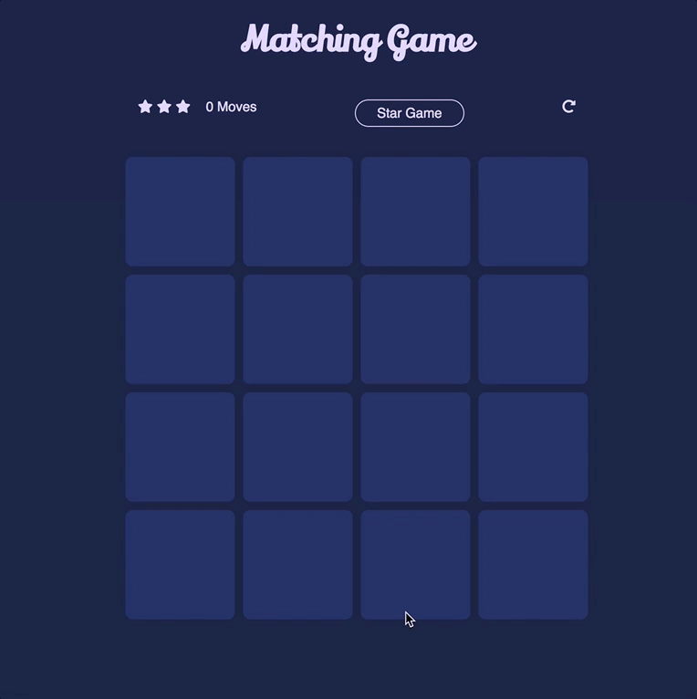

# Udacity-Memory-Game

A JS memory game that is part of the Udacity Frontend Nanodegree program
The game uses basic `HTML` `CSS` and `JS`

## Dependencies

There were a couple of libraries used throughout this project which are:

* [Google font](https://fonts.google.com/)
* [Fontawesome](https://origin.fontawesome.com/)

## Resources

For this project, I 've used a couple of resources around the web which will be listed and what they were used for.

* David DeSandro website that explains 3D transforms in CSS [Card Flip](https://3dtransforms.desandro.com/card-flip)
* Stackoverflow answer explaining how to [convert DOM collections to arrays](https://stackoverflow.com/questions/2735067/how-to-convert-a-dom-node-list-to-an-array-in-javascript)
* answers on Stackoverflow that helped me with [event bubbling](https://stackoverflow.com/questions/6203042/how-do-i-prevent-a-click-handler-being-triggered-when-a-child-element-is-clicked)
* Ilya Kantor's Javascript info website on [traversing the DOM](https://javascript.info/dom-navigation#children-childnodes-firstchild-lastchild)
* CSS-Tricks on [disabiling elements](https://css-tricks.com/almanac/properties/p/pointer-events/)
* Stackoverflow on [shuffling arrays](https://stackoverflow.com/questions/2450954/how-to-randomize-shuffle-a-javascript-array/2450976#2450976)
* Stackoverflow on [timer functions](https://stackoverflow.com/questions/29971898/how-to-create-an-accurate-timer-in-javascript)
